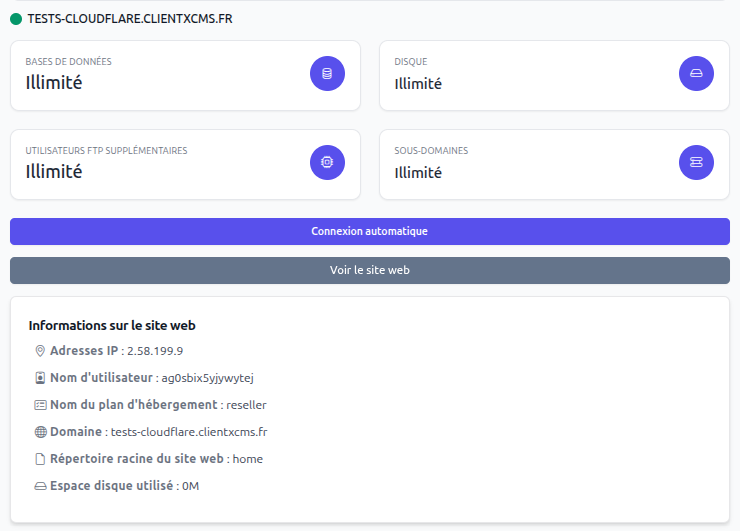

# cPanel

Le module cPanel permet de fournir des offres cPanel à vos clients. Le module supporte hébergement simple. Il fonctionne avec les plans cPanel qui facilite grandement sa configuration puisqu'il suffit de lié un produit à un plan cPanel.

:::info Modules
Pour utiliser les fonctionnalités suivantes, il faut que le module cPanel soit activé sur votre CLIENTXCMS. [cliquez ici pour l'activer](../)
:::
### Fonctionnalités supportées 
- Automatisez la création et l'approvisionnement des comptes
- Gestion des hébergements depuis l'espace client
- Envoie des identifiants de connexion par E-mail
- Connexion automatique au cPanel
- Automatisez les suspensions et les résiliations
- Amélioration de service
- Importation des comptes cPanel existants

## Création de la clé d'API

Pour utiliser le module cPanel, vous devez d'abord créer une clé d'API dans votre cPanel. Pour ceci, connectez-vous à votre cPanel et allez dans `API Tokens` ou `Clés API` (selon la langue de votre cPanel). Cliquez sur `Créer` pour générer une nouvelle clé d'API.

Donnez un nom à votre clé d'API, par exemple `CLIENTXCMS`, et sélectionnez les permissions nécessaires. Pour le module cPanel, vous aurez besoin des permissions suivantes :
- Initial privileges
- Account Management
- Account Information

Sauvegardez la clé d'API générée, car vous en aurez besoin pour configurer le module dans CLIENTXCMS.
## Création du serveur

Créez un serveur CLIENTXCMS dans `Espace d'administration ` > `Paramètre` > `Approvisionnement` > `Serveurs` > `Nouveau` en sélectionnant le type de serveur en "cPanel".

**Adresse IP** : Sous domaine ou adresse IP du cPanel

**Port** : 2087 (par défaut pour cPanel)

**Username** : Nom d'utilisateur que vous avez utilisé pour vous connecter à votre cPanel

**Password** : Clé d'API que vous avez générée précédemment

Le port suivant doit être ouvert pour connecter CLIENTXCMS à votre WHM : 2087

Vous pouvez tester la connexion au serveur et vérifier que le serveur renvoie *"Success"* en réponse.

## Configuration de l'offre
En premier lieu, [créez votre produit](../../settings/store/products.md#créer-un-nouveau-produit) en sélectionnant cPanel.

Après appuyer sur le bouton "Créer" il vous crée votre produit et puis cliquer sur le bouton "Configurer l'offre" qui vous dirigera vers la page de configuration de l'offre. Si les champs est vide, assurez-vous que votre serveur ne soit pas caché, dans ce cas il ne sera pris en compte dans le système pour récupérer les plans Plesk.

Dans cette page, vous pourrez sélectionner le plan qui faudra livrer à vos clients puis sauvegarder.

### Panel de gestion

import Tabs from '@theme/Tabs';
import TabItem from '@theme/TabItem';

<Tabs>
<TabItem value="Hosting" label="Hébergement">

</TabItem>

</Tabs>

## Metadonnées utilisées

| Clé        | Valeur            | Description              |
|------------|-------------------|--------------------------|
| `username` | string            | Identifiant du client    |
| `domain`   | string            | Domaine du webspace      |

## Importer un compte cPanel existant

Si vous avez déjà des comptes cPanel existants, vous pouvez les importer dans CLIENTXCMS. Pour cela, allez dans `Espace d'administration` > `Services` > `Créer`.
Plus d'informations sur la création de service [ici](/services/). Vous pourrez sélectionner l'hébergement cPanel que vous souhaitez importer dans la liste des hébergements disponibles.